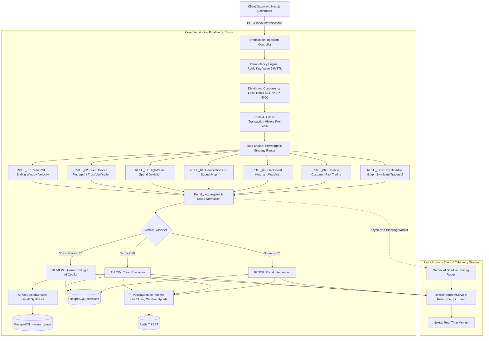

# SentinelX — Real-Time Financial Fraud & Risk Decisioning Platform

[](https://openjdk.org/)
[](https://spring.io/projects/spring-boot)
[-black.svg?style=flat&logo=next.js)](https://nextjs.org/)
[](https://www.postgresql.org/)
[](https://redis.io/)
[]()
[]()

**SentinelX** is an enterprise-grade, high-throughput Financial Fraud & Risk Decisioning Platform. It evaluates incoming financial transactions synchronously in real time ($< 15\text{ms}$ rule engine execution, $< 50\text{ms}$ end-to-end SLA) to emit definitive risk verdicts: **`ALLOW`**, **`REVIEW`**, or **`BLOCK`**.

Built around core Computer Science design principles: **Polymorphic Strategy Rule Engine**, **Redis Sorted Sets (`ZSET`) Sliding Window Velocity**, **2-Hop Bipartite Graph Syndicate Traversal**, **Header-Based Idempotency**, **Distributed Concurrency Locking**, and **Zero-Impact AI Shadow Scoring**.

---

## 📚 Technical Documentation Suite

Comprehensive engineering specifications are organized in the [`docs/`](./docs) directory:

| Document | Description |
| :--- | :--- |
| 🏛️ **[Architecture & Technical Design Specification](./docs/ARCHITECTURE_SPECIFICATION.md)** | High-Level and Low-Level Design (HLD/LLD), component architecture, sequence diagrams, and database schemas. |
| 📖 **[REST API Reference Guide](./docs/API_REFERENCE.md)** | Complete endpoint specifications, JSON request/response schemas, cURL examples, and error codes. |
| 🛡️ **[Fraud Detection Taxonomy & Strategy Matrix](./docs/FRAUD_DETECTION_TAXONOMY.md)** | Threat models, mathematical criteria, and weight configurations for rules `RULE_01` through `RULE_07`. |
| 🚀 **[Operations & Deployment Runbook](./docs/OPERATIONS_AND_DEPLOYMENT_RUNBOOK.md)** | Infrastructure setup, environment configuration, database seeding, and disaster recovery procedures. |

---

## 🏛️ System Architecture



---

## 🚀 Key Subsystems

* **Dynamic Strategy Rule Engine (`RiskRule`)**: Decoupled, polymorphic rule strategies evaluated against an in-memory cache with dynamic runtime weight re-configuration.
* **Redis Sliding Window Velocity (`ZSET` + Atomic Lua)**: High-performance $O(\log N)$ frequency tracking across 5-minute rolling windows with automatic database fallback.
* **Graph Syndicate & Fraud Ring Engine**: Sub-millisecond 2-hop **Breadth-First Search (BFS)** graph traversal uncovering accounts that share physical devices or cards with banned fraudsters.
* **Historical Replay & Backtesting Simulation Studio**: Non-persisted dry-run scoring engine testing candidate rule strategies against a 250-transaction benchmark matrix.
* **Enterprise Idempotency & Distributed Concurrency Locks**: Prevents duplicate charges via `Idempotency-Key` headers and serializes concurrent user requests via Redis mutex locks.
* **AI Risk Copilot & Shadow Scoring**: Generates natural language reasoning for held review cases and benchmarks zero-shot AI fraud scoring in the background.

---

## 📊 Core Fraud Detection Strategies

| Rule ID | Rule Strategy | Default Weight | Mechanism |
| :--- | :--- | :---: | :--- |
| **`RULE_01`** | **High Velocity (5m)** | `+40 pts` | Redis `ZSET` Sliding Window Log ($> 5$ txns in 300s). |
| **`RULE_02`** | **New Untrusted Device** | `+25 pts` | SHA-256 client device fingerprint verification. |
| **`RULE_03`** | **High-Value Transaction** | `+50 pts` | Monetary spend deviation threshold ($> \$10,000$). |
| **`RULE_04`** | **Rapid IP Change (Geo Hop)** | `+60 pts` | IP subnet transition within 30 minutes. |
| **`RULE_05`** | **Blacklisted Merchant** | `+80 pts` | High-risk sanctioned merchant watchlist match. |
| **`RULE_06`** | **User Risk Tier** | `+30 pts` | Account risk profile baseline (`HIGH` / `CRITICAL`). |
| **`RULE_07`** | **Syndicate Fraud Ring** | `+75 pts` | 2-Hop BFS graph traversal on shared hardware & cards. |

---

## 🛠️ Quick Start Guide

### 1. Launch Infrastructure
```bash
docker compose up -d
```

### 2. Start Spring Boot Backend
```bash
cd sentinelx-backend
./mvnw spring-boot:run
```
* Interactive OpenAPI Swagger UI: `http://localhost:8080/swagger-ui.html`

### 3. Start Next.js Frontend Dashboard
```bash
cd sentinelx-frontend
npm install
npm run dev
```
* Live Dashboard: `http://localhost:3000`

---

## 🧪 Verification & Test Suite

```bash
# Execute 59 automated unit, integration, and benchmark tests
cd sentinelx-backend
./mvnw test

# Execute Next.js linter and production build
cd ../sentinelx-frontend
npm run lint && npm run build
```
