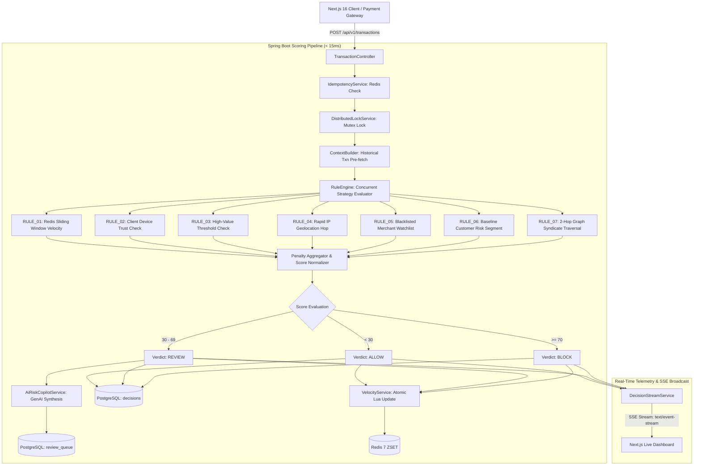
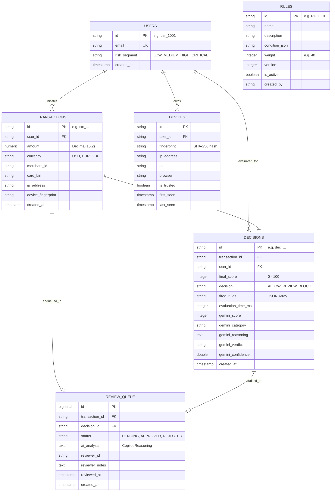
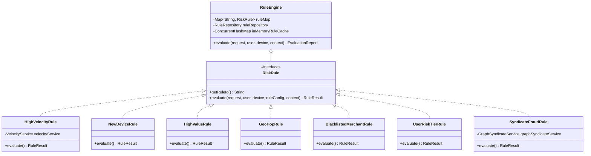

# SentinelX — System Architecture & Low-Level Design (LLD)

This document details the architectural decisions, database schemas, class relationships, and execution flow of SentinelX.

---

## 1. High-Level System Architecture

---

## 2. Database Entity-Relationship Diagram (PostgreSQL)

---

## 3. Core Class Design & Design Patterns

### A. Strategy Pattern Class Structure

---

## 4. Key Request Flows

### Ingestion Flow (`POST /api/v1/transactions`)
1. Client submits JSON payload with optional `Idempotency-Key` header.
2. `TransactionController` validates DTO constraints (`@Valid`).
3. `IdempotencyService` checks Redis cache: if key exists, returns cached verdict immediately ($< 1\text{ms}$).
4. `DistributedLockService` acquires atomic mutex lock on `userId` (`SET NX PX 5000`).
5. `RiskService` loads `User` and `Device` records.
6. `RuleEngine` evaluates active rules (`RULE_01` to `RULE_07`) against `EvaluationContext`.
7. Aggregator computes total risk score ($0$–$100$) and assigns verdict (`ALLOW`, `REVIEW`, `BLOCK`).
8. If `REVIEW`, `AiRiskCopilotService` synthesizes multi-signal correlation and routes to `review_queue`.
9. `VelocityService` executes atomic Redis Lua sliding-window update.
10. `DecisionStreamService` broadcasts event to connected SSE subscribers.
11. `IdempotencyService` caches decision in Redis (24h TTL).
12. `DistributedLockService` safely releases user mutex lock via Lua script.
13. Returns `DecisionResponse` to client with execution latency ($< 15\text{ms}$).
