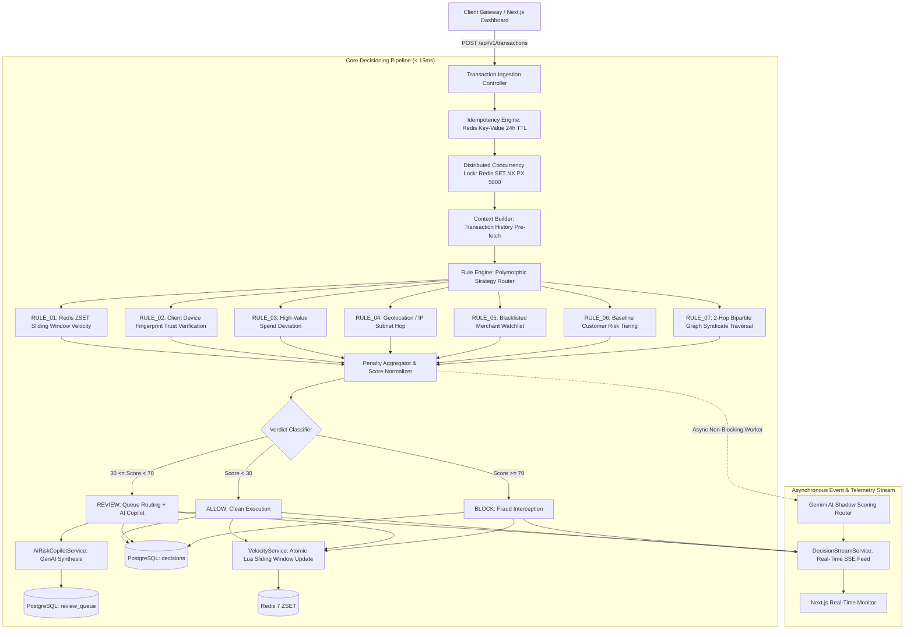
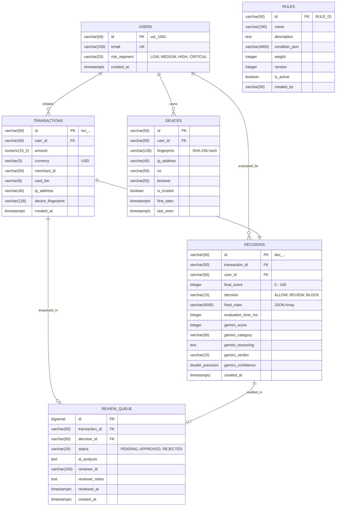

# SentinelX — Architecture & Technical Design Specification

## 1. System Overview & Engineering Principles

SentinelX is a synchronous, high-throughput Financial Fraud & Risk Decisioning Platform engineered in **Java 21 LTS (Spring Boot 3.4.x)** and backed by **PostgreSQL 16** and an **in-memory Redis 7 acceleration layer**.

The system evaluates inbound payment transactions in real time ($< 15\text{ms}$ rule engine execution, $< 50\text{ms}$ end-to-end SLA) to emit deterministic operational verdicts:
* **`ALLOW`** ($\text{Score} < 30$): Approved synchronously.
* **`REVIEW`** ($30 \le \text{Score} < 70$): Held for human-in-the-loop analyst review with GenAI reasoning synthesis.
* **`BLOCK`** ($\text{Score} \ge 70$): High-confidence fraud rejected immediately.

---

## 2. High-Level Architecture (HLD)



---

## 3. Low-Level Design (LLD) & Core Subsystems

### 3.1 Polymorphic Strategy Rule Engine
The rule engine utilizes the **GoF Strategy Pattern** to decouple individual detection heuristics from the evaluation pipeline.

* **Strategy Interface**: `com.sentinelx.backend.rule.RiskRule`
  ```java
  public interface RiskRule {
      String getRuleId();
      RuleResult evaluate(TransactionRequest request, User user, Device device, Rule ruleConfig, EvaluationContext context);
  }
  ```
* **Thread-Safe Rule Cache**: Rules are pre-cached in a `ConcurrentHashMap<String, Rule>` to ensure $O(1)$ memory lookups during execution without hitting relational storage for every transaction.
* **Dynamic Hot-Reloading**: Rule weights and active states can be modified at runtime via `PUT /api/v1/rules/{id}` without requiring application restarts.

---

### 3.2 Redis Sliding Window Log Velocity Engine
To prevent velocity botnets and card testing attacks, SentinelX uses an in-memory **Sliding Window Log algorithm** implemented on Redis Sorted Sets (`ZSET`).

* **Data Structure**: Redis key `sentinelx:velocity:user:{userId}` where member is `transactionId` and score is epoch millisecond timestamp.
* **Atomic Lua Script**:
  ```lua
  local key = KEYS[1]
  local now = tonumber(ARGV[1])
  local windowSeconds = tonumber(ARGV[2])
  local txnId = ARGV[3]
  local clearBefore = now - (windowSeconds * 1000)

  -- 1. Evict expired entries outside active window
  redis.call('ZREMRANGEBYSCORE', key, '-inf', clearBefore)
  -- 2. Insert current transaction timestamp
  redis.call('ZADD', key, now, txnId)
  -- 3. Set rolling expiration TTL
  redis.call('EXPIRE', key, windowSeconds * 2)
  -- 4. Return total active events in window
  return redis.call('ZCARD', key)
  ```
* **Complexity**: $O(\log N + M)$ where $M$ is the count of expired entries evicted.
* **Fail-Safe Fallback**: If Redis is unreachable, the engine gracefully degrades to query PostgreSQL transaction history over a bounded SQL window.

---

### 3.3 Graph Syndicate & Fraud Ring Engine
Detects multi-account collusion networks by modeling entities as nodes in a bipartite graph.

* **Graph Representation**:
  * **Nodes**: `USER`, `DEVICE`, `IP`, `CARD`
  * **Edges**: `USED_DEVICE`, `SHARED_IP`, `USED_CARD`
* **Algorithm**: 2-hop **Breadth-First Search (BFS)** traversal:
  $$\text{User A} \xrightarrow{\text{USED\_DEVICE}} \text{Device Fingerprint} \xrightarrow{\text{USED\_DEVICE}} \text{User B (BLOCKED)}$$
* **Complexity**: $O(V + E)$ bounded to max-depth 2, executing in $< 1\text{ms}$ in-memory.

---

### 3.4 Idempotency & Distributed Concurrency Locking
* **Idempotency**: Clients supply an optional `Idempotency-Key` HTTP header. If the key exists in Redis (`sentinelx:idempotency:{key}`, 24h TTL), SentinelX immediately returns the cached `DecisionResponse` with zero duplicate database mutations or false velocity increments.
* **Distributed Mutex Lock**: Uses Redis `SET sentinelx:lock:user:{userId} {token} NX PX 5000` to serialize concurrent requests originating from the same customer ID, preventing parallel threshold evasion.

---

## 4. Database Schema Specification (PostgreSQL 16)


